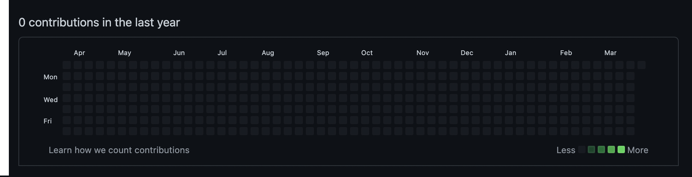

# Hack-Github-Contribution-Chart


[](./LICENSE)

A python based script to help you modify your github contribution chart back in the past. This project is created only for educational purposes.

### Inspiration
The inspiration for this project comes from the very famous meme 👇 


## Prerequisite 
```
python3 --version
Python 3.7.6
```

## Usage Instructions

Run HackChart.py file using the following command 
```
python3 HackChart.py
```


## Output

It may take few seconds depending upon the number of days you have chosen.

The origial GitHub contribution chart 👇🏻



The hacked GitHub contribution chart 👇🏻


# License

[The MIT License (MIT)](LICENSE)
